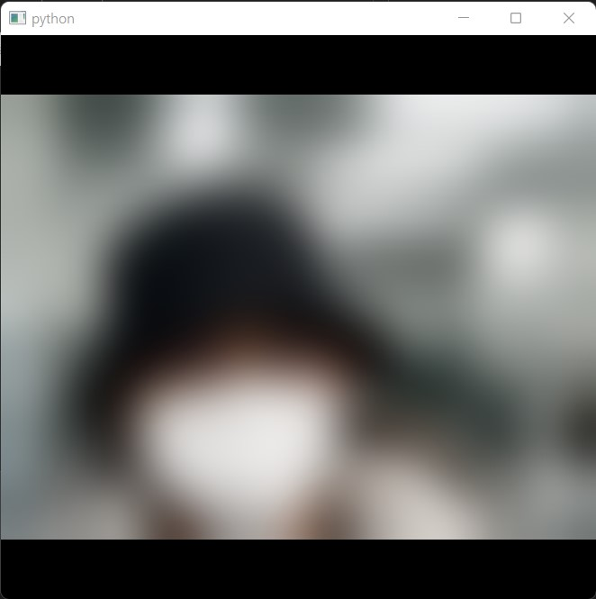

Processing frames from camera
=============================

This example shows how to run a camera widget using ``QVideoFrame``-based processing pipeline.

   Frame-based camera widget with Gaussian blurring process

.. tabs::

   .. tab:: PySide6

      .. include:: ./PySide6/frame.camera.py
         :code: python

   .. tab:: PyQt6

      .. include:: ./PyQt6/frame.camera.py
         :code: python
