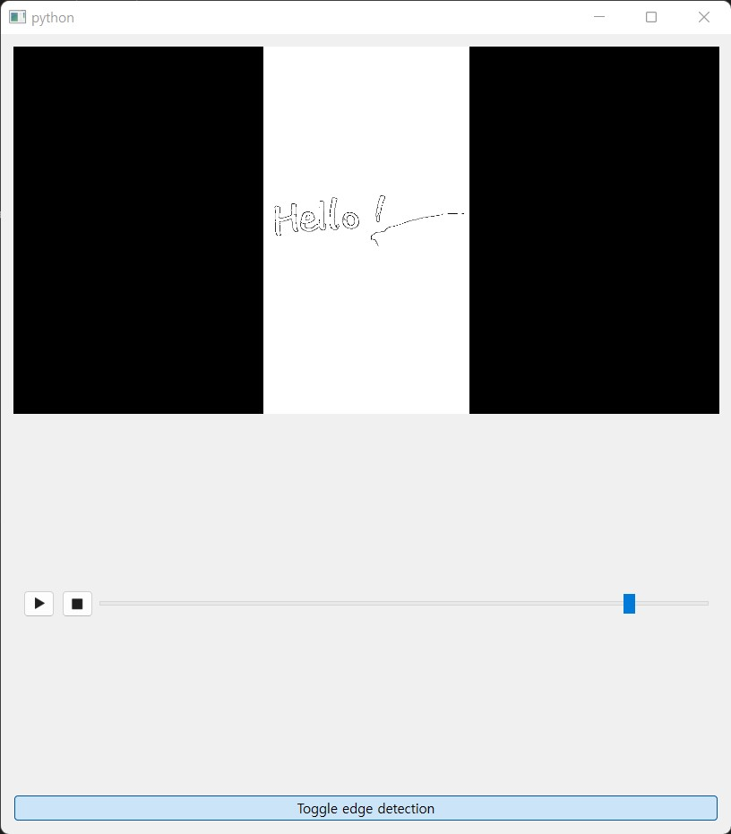

Processing frames from video player
===================================

This example shows how to run a video player widget using ``QVideoFrame``-based processing pipeline.

   Frame-based video player widget with Canny edge detection process

.. tabs::

   .. tab:: PySide6

      .. include:: ./PySide6/frame.player.py
         :code: python

   .. tab:: PyQt6

      .. include:: ./PyQt6/frame.player.py
         :code: python
