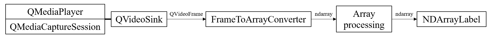

.. _intro:

============
Introduction
============

.. currentmodule:: araviq6

   Video display pipeline with AraViQ6

AraViQ6 is a Python package for converting Qt6 `QVideoFrame <https://doc.qt.io/qt-6/qvideoframe.html>`_ to :class:`numpy.ndarray` and display it on GUI.
This task is very common in scientific visualizing, especially in the field of image analysis.

AraViQ is designed to be used with either `PySide6 <https://pypi.org/project/PySide6/>`_ or `PyQt6 <https://pypi.org/project/PyQt6/>`_.
However, PyQt6 is not available until the dependent package, `qimage2ndarray <https://pypi.org/project/qimage2ndarray/>`_, supports it.

How to use
==========

AraViQ must be imported **after** the Qt package is imported.

.. code:: python

   import PySide6
   import araviq6 as avq

User can build a video pipeline to combine array manipulation and video displaying.
:class:`.FrameToArrayConverter` converts the video frame to numpy array.
After any desired processing is done, the resulting array can be passed to :class:`.NDArrayLabel` to be displayed.

:class:`.NDArrayVideoPlayer` and :class:`.NDArrayMediaCaptureSession` provide some boilerplates for the pipeline.

:class:`.NDArrayVideoPlayerWidget` and :class:`.NDArrayCameraWidget` are convenience classes with pre-built pipelines.
Use these widgets if you need quick implementation of single-threaded video processing.

For more information, see :ref:`Reference <reference>` and :ref:`Examples <examples>` pages.

Supported Qt bindings
=====================

AraViQ6 is compatible with the following Qt binding packages:

* `PySide6 <https://pypi.org/project/PySide6/>`_
* `PyQt6 <https://pypi.org/project/PyQt6/>`_

When AraViQ6 is imported, available package is searched and selected in the order mentioned above.
To force a particular API, set environment variable ``AraViQ_QT_API`` with package name. Letter case does not matter.
