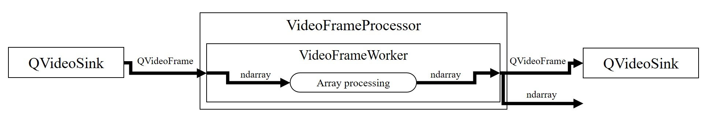
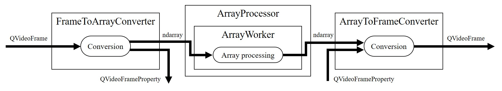
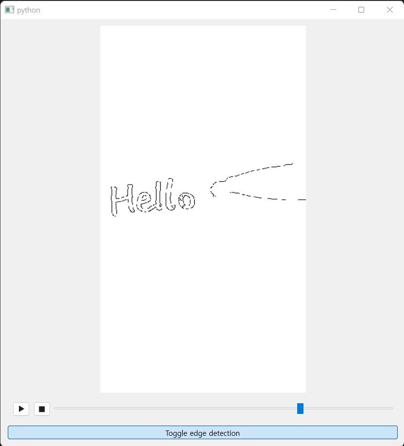

.. _intro:

============
Introduction
============

.. currentmodule:: araviq6

AraViQ6 is a Python package which integrates NDArray-based image processing with video pipeline of Qt6.
It is designed to help scientific programmers who want to quickly visualize the video without complicated framework.

Using AraViQ6, QVideoFrame can be processed with a simple signal-slot pipeline.
This is useful to visualize the video supported by Qt Multimedia scheme.

   QVideoFrame pipeline with AraViQ6

In third-party packages, video stream can be provided as NDArray instead of QVideoFrame.
AraViQ supports array-based pipeline and convenience classes to handle NDArray as well.

   NDArray pipeline with AraViQ6

Here is a sample which performs `Canny edge detection <https://en.wikipedia.org/wiki/Canny_edge_detector>`_ on the video frame.
The code can be found in :ref:`examples`.

   Video player with canny edge detection.

For more information, see :ref:`user-guide` and :ref:`reference`.

Supported Qt bindings
=====================

AraViQ6 is compatible with the following Qt binding packages:

* `PySide6 <https://pypi.org/project/PySide6/>`_
* `PyQt6 <https://pypi.org/project/PyQt6/>`_

When AraViQ6 is imported, available package is searched and selected in the order mentioned above.
To force a particular API, set environment variable ``ARAVIQ_QT_API`` with package name. Letter case does not matter.
