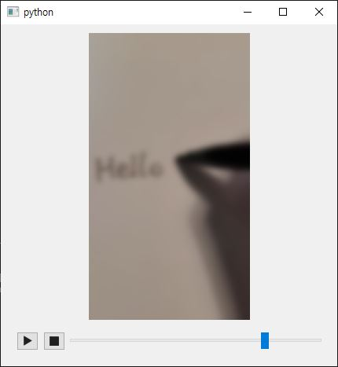
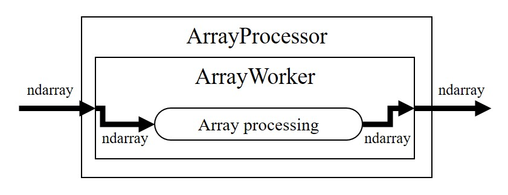

.. _guide-arraypipeline:

===================================
How to build NDArray-based pipeline
===================================

.. currentmodule:: araviq6

In :ref:`guide-processor`, we built a processor and a pipline based on QVideoFrame.
Now let's learn how to build NDArray-based pipeline.

.. figure:: ../_images/array-pipeline.jpg
   :align: center

   NDArray-based pipeline design

Introduction
------------

Third party packages (e.g., Python binding of machine vision driver) often provide video frames as NDArray.
Also the user may need the image processing result as numpy array for further tasks.
These are where we need a pipeline with NDArray.

AraViQ6 provides :class:`.ArrayToFrameConverter` and :class:`.FrameToArrayConverter` which converts NDArray to QVideoFrame and vice versa.
Although attaching these classes to QVideoFrame-based pipeline effectively acts as NDArray pipeline, there are several classes which directly handles NDArray.

1. :class:`.NDArrayVideoPlayer` and :class:`.NDArrayMediaCaptureSession` as array source
2. :class:`.ArrayProcessor` as array processor
3. :class:`.NDArrayLabel` to display array

Using the classes above, we will construct a video player which is identical to that of :ref:`guide-processor`.
Here is the complete code:

.. tabs::

   .. code-tab:: python PySide6

      import cv2  # type: ignore[import]
      import sys
      from PySide6.QtCore import Qt, QUrl
      from PySide6.QtWidgets import QWidget, QVBoxLayout, QApplication
      from PySide6.QtMultimedia import QMediaPlayer
      from araviq6 import (
          ArrayWorker,
          ArrayProcessor,
          NDArrayVideoPlayer,
          NDArrayLabel,
          MediaController,
          get_data_path,
      )

      class BlurWorker(ArrayWorker):
          def processArray(self, array):
              if array.size != 0:
                  return cv2.GaussianBlur(array, (0, 0), 9)
              return array

      class BlurWidget(QWidget):
          def __init__(self, parent=None):
              super().__init__(parent)
              self.videoPlayer = NDArrayVideoPlayer(self)
              self.arrayProcessor = ArrayProcessor()
              self.arrayLabel = NDArrayLabel()
              self.mediaController = MediaController()

              self.videoPlayer.arrayChanged.connect(self.arrayProcessor.processArray)
              self.arrayProcessor.arrayProcessed.connect(self.arrayLabel.setArray)

              self.arrayProcessor.setWorker(BlurWorker())
              self.mediaController.setPlayer(self.videoPlayer)
              self.arrayLabel.setAlignment(Qt.AlignCenter)

              layout = QVBoxLayout()
              layout.addWidget(self.arrayLabel)
              layout.addWidget(self.mediaController)
              self.setLayout(layout)

          def closeEvent(self, event):
              self.arrayProcessor.stop()
              super().closeEvent(event)

      app = QApplication(sys.argv)
      w = BlurWidget()
      w.videoPlayer.setSource(QUrl.fromLocalFile(get_data_path('hello.mp4')))
      w.show()
      app.exec()
      app.quit()

   .. code-tab:: python PyQt6

      import cv2  # type: ignore[import]
      import sys
      from PyQt6.QtCore import Qt, QUrl
      from PyQt6.QtWidgets import QWidget, QVBoxLayout, QApplication
      from PyQt6.QtMultimedia import QMediaPlayer
      from araviq6 import (
          ArrayWorker,
          ArrayProcessor,
          NDArrayVideoPlayer,
          NDArrayLabel,
          MediaController,
          get_data_path,
      )

      class BlurWorker(ArrayWorker):
          def processArray(self, array):
              if array.size != 0:
                  return cv2.GaussianBlur(array, (0, 0), 9)
              return array

      class BlurWidget(QWidget):
          def __init__(self, parent=None):
              super().__init__(parent)
              self.videoPlayer = NDArrayVideoPlayer(self)
              self.arrayProcessor = ArrayProcessor()
              self.arrayLabel = NDArrayLabel()
              self.mediaController = MediaController()

              self.videoPlayer.arrayChanged.connect(self.arrayProcessor.processArray)
              self.arrayProcessor.arrayProcessed.connect(self.arrayLabel.setArray)

              self.arrayProcessor.setWorker(BlurWorker())
              self.mediaController.setPlayer(self.videoPlayer)
              self.arrayLabel.setAlignment(Qt.AlignCenter)

              layout = QVBoxLayout()
              layout.addWidget(self.arrayLabel)
              layout.addWidget(self.mediaController)
              self.setLayout(layout)

          def closeEvent(self, event):
              self.arrayProcessor.stop()
              super().closeEvent(event)

      app = QApplication(sys.argv)
      w = BlurWidget()
      w.videoPlayer.setSource(QUrl.fromLocalFile(get_data_path('hello.mp4')))
      w.show()
      app.exec()
      app.quit()

   Blurring player based on NDArray

Now let's take a closer look at this code by parts.

Array processor
---------------

Just as QVideoFrame processor (which we explored in :ref:`guide-processor`), NDArray processing consists of a worker running in a processor.

   NDArray processor design

We defined :class:`BlurWorker` all the same with that in the previous page, except that we now subclass :class:`.ArrayWorker` instead of :class:`.VideoFrameWorker`.

.. code-block:: python

    class BlurWorker(ArrayWorker):
        def processArray(self, array):
            if array.size != 0:
                return cv2.GaussianBlur(array, (0, 0), 9)
            return array

Inside :class:`BlurWidget` we constructed the worker and the processor, and set the former to the latter.

.. code-block:: python

    class BlurWidget(QWidget):
        def __init__(self, parent=None):
            ...
            self.arrayProcessor = ArrayProcessor()
            self.arrayLabel = NDArrayLabel()
            ...
            self.arrayProcessor.setWorker(BlurWorker())

When the main window is closed, array processor must be stopped to kill the internal thread.

.. code-block:: python

    class BlurWidget(QWidget):
        ...
        def closeEvent(self, event):
            self.arrayProcessor.stop()
            super().closeEvent(event)

NDArray video player
--------------------

Qt's :class:`QMediaPlayer` emits the frames as QVideoFrame via its video sink.
:class:`.NDArrayVideoPlayer` is a convenience class which emits the frames as NDArray, using internal pipeline.

Inside :class:`BlurWidget` we constructed the NDArray video player and connected its signal directly to the processor.
If we didn't use :class:`.NDArrayVideoPlayer`, we'd have to set QVideoSink to QMediaPlayer, connect QVideoSink to :class:`.FrameToArrayConverter` and then connect the converter to the processor.

.. code-block:: python

    class BlurWidget(QWidget):
        def __init__(self, parent=None):
            self.videoPlayer = NDArrayVideoPlayer(self)
            ...
            self.videoPlayer.arrayChanged.connect(self.arrayProcessor.processArray)

Also we set the player to :class:`.MediaController` so that we can control the playback state and the positon of the player.

.. code-block:: python

    class BlurWidget(QWidget):
        def __init__(self, parent=None):
            ...
            self.mediaController = MediaController()
            ...
            self.mediaController.setPlayer(self.videoPlayer)

NDArray label
-------------

Qt's :class:`QVideoWidget` which automatically resizes the displayed QVideoFrame.
:class:`QLabel`, however, displays only the :class:`QPixmap` and does not resize its content.

AraViQ6 provides :class:`ScalableQLabel` and its subclass, :class:`NDArrayLabel`.
ScalableQLabel is a subclass of QLabel which can resize the pixmap.
NDArrayLable can, in addition, display the input array to the screen.

We constructed NDArray label instance, added it to the layout of :class:`BlurWidget` and connected the processor's array signal to the label.
If we didn't use :class:`.NDArrayLabel`, we'd have to connect the processor to :class:`.ArrayToFrameConverter`, then connect the converter to QVideoWidget's QVideoSink.

.. code-block:: python

    class BlurWidget(QWidget):
        def __init__(self, parent=None):
            ...
            self.arrayLabel = NDArrayLabel()
            ...
            self.arrayProcessor.arrayProcessed.connect(self.arrayLabel.setArray)
            ...
            self.arrayLabel.setAlignment(Qt.AlignCenter)

Note that as ordinary, QLabel, the alignment of the label can be set.
