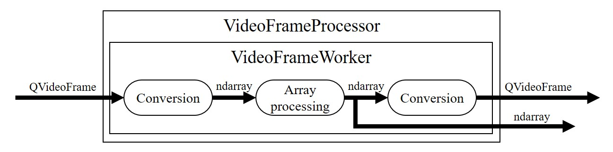
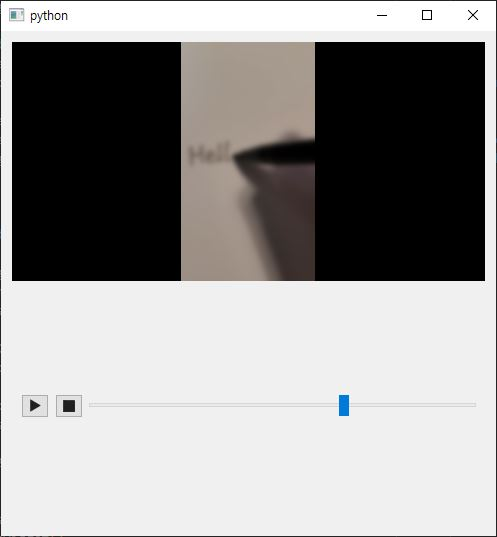

=================================
How to implement video processing
=================================

.. currentmodule:: araviq6

This guide explains how to define a video processing with AraViQ6 and how the processor works.

   QVideoFrame processor design

Introduction
------------

AraViQ6 provides multithreaded processing with processors and workers.
In QVideoFrame pipeline, for example, processing is done by :class:`.VideoFrameWorker` running in :class:`.VideoFrameProcesor`.
The results are provided in both QVideoFrame and NDArray, allowing the users to choose whatever they need.

Defining and setting the worker is very easy.
Here, we will construct a video player widget with blurring process using :class:`.PlayerProcessWidget`.
This class provides internal media player, video widget and controller - all you have to do is define and set the worker.

Building the worker
-------------------

We subclass :class:`.VideoFrameWorker` to define :class:`BlurWorker` with OpenCV-Python's :func:`GaussianBlur`.
As we set the worker to :class:`.PlayerProcessWidget`, the widget automatically connects the pipeline from the player to the display via the processor.

.. tabs::

    .. code-tab:: python PySide6

        import cv2  # type: ignore
        from PySide6.QtCore import QUrl
        from PySide6.QtWidgets import QApplication
        import sys
        from araviq6 import PlayerProcessWidget, VideoFrameWorker
        from araviq6.util import get_samples_path

        class BlurWorker(VideoFrameWorker):
            def processArray(self, array):
                if array.size != 0:  # video player emits empty frame at the end of the video
                    return cv2.GaussianBlur(array, (0, 0), 9)
                return array

        app = QApplication(sys.argv)
        w = PlayerProcessWidget()
        w.setWorker(BlurWorker())
        w.setSource(QUrl.fromLocalFile(get_samples_path('hello.mp4')))
        w.show()
        app.exec()
        app.quit()

   Blurring processor

:class:`BlurWorker` is set to pre-built :class:`.VideoFrameProcesor` of :class:`.PlayerProcessWidget` and run in internal thread.
QVideoFrame from the player is converted to NDArray, processed by :meth:`processArray`, and converted back to QVideoFrame to be set to the video widget.

Controlling frame skip
----------------------

QMediaPlayer emits the frames in constant rate, and video processing can be considerably slower than that.
To avoid having too many frames queued, :class:`.VideoFrameProcesor` ignores incoming frames when the worker is running.

The following code performs Gaussian blurring with much higher sigma value, causing each frame to take longer to be processed.
The resulting video has lower frame rate, but the controller position agrees with the displayed frame because frames are skipped.

.. tabs::

    .. code-tab:: python PySide6

        import cv2  # type: ignore
        from PySide6.QtCore import QUrl
        from PySide6.QtWidgets import QApplication
        import sys
        from araviq6 import PlayerProcessWidget, VideoFrameWorker
        from araviq6.util import get_samples_path

        class BlurWorker(VideoFrameWorker):
            def processArray(self, array):
                if array.size != 0:
                    return cv2.GaussianBlur(array, (0, 0), 45)
                return array

        app = QApplication(sys.argv)
        w = PlayerProcessWidget()
        w.setWorker(BlurWorker())
        w.setSource(QUrl.fromLocalFile(get_samples_path('hello.mp4')))
        w.show()
        app.exec()
        app.quit()

Now this can be desirable when we are just displaying the video, but we need different approach when every frame must be grabbed (e.g., when saving the video).

Setting :meth:`.VideoFrameProcesor.skipIfRunning` to False forces every frame from the player to be queued to the worker.
Run the following code and see how the widget behaves.

.. tabs::

    .. code-tab:: python PySide6

        import cv2  # type: ignore
        from PySide6.QtCore import QUrl
        from PySide6.QtWidgets import QApplication
        import sys
        from araviq6 import PlayerProcessWidget, VideoFrameWorker
        from araviq6.util import get_samples_path

        class BlurWorker(VideoFrameWorker):
            def processArray(self, array):
                if array.size != 0:
                    return cv2.GaussianBlur(array, (0, 0), 45)
                return array

        app = QApplication(sys.argv)
        w = PlayerProcessWidget()
        w.frameProcessor().setSkipIfRunning(False)
        w.setWorker(BlurWorker())
        w.setSource(QUrl.fromLocalFile(get_samples_path('hello.mp4')))
        w.show()
        app.exec()
        app.quit()

Frame rate is still low, but the video now looks like a slow-motion because every frame is displayed one-by-one.
Also, the controller is now too fast for the video and your app may have crashed if your machine has low memory.

This is because the frames from the player are queued in the worker thread.
Controller shows current position of the player, where the display shows older frames that were just processed.
Furthermore, queued frames can take extremely large memory which can be a serious problem.

There are two ways to avoid this issue.

1. Reduce the frame rate of the frame source.
2. Define a new player which buffers procesed frames.

For camera, the first one is the only option.
The second option is the most fundamental solution, but it exceeds the scope of AraViQ6 so we do not cover it here.
